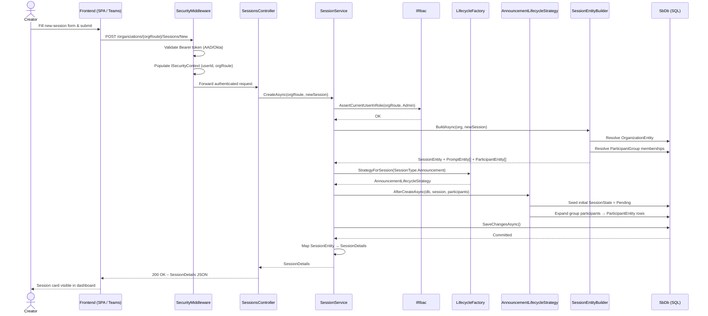

# Flow: Session Creation

## Overview
Session creation is the foundational multistage transaction in Soundbite. A creator or administrator authors a new broadcast session — naming it, selecting its type, assigning participants and groups, and optionally linking it to a recurring Series. The platform persists the session entity, constructs its prompt structure, seeds participant records, and prepares the session for the media contribution phase.

## Code Involved

| Layer | File | Role |
|-------|------|------|
| API Controller | [`Soundbite.Api/Controllers/SessionsController.cs`](../Soundbite.Api/Controllers/SessionsController.cs) | Exposes `POST /organizations/{orgRoute}/Sessions/New`; delegates to service |
| Service | [`Soundbite.Services/Services/SessionService.cs`](../Soundbite.Services/Services/SessionService.cs) | Orchestrates creation: RBAC check, builder invocation, lifecycle hook, persistence |
| Builder | [`Soundbite.Services/SessionEntityBuilder.cs`](../Soundbite.Services/SessionEntityBuilder.cs) | Constructs `SessionEntity` + `PromptEntity` tree from `NewSession` input |
| Lifecycle Factory | [`Soundbite.Services/Lifecycle/LifecycleFactory.cs`](../Soundbite.Services/Lifecycle/LifecycleFactory.cs) | Returns the correct `ILifecycleStrategy` for the session type |
| Lifecycle Strategy | [`Soundbite.Services/Lifecycle/AnnouncementLifecycleStrategy.cs`](../Soundbite.Services/Lifecycle/AnnouncementLifecycleStrategy.cs) | Executes post-creation hooks (participant expansion, initial state) |
| Data Model | [`Soundbite.Entity/Entities/SessionEntity.cs`](../Soundbite.Entity/Entities/SessionEntity.cs) | Persisted session root |
| Data Model | [`Soundbite.Entity/Entities/PromptEntity.cs`](../Soundbite.Entity/Entities/PromptEntity.cs) | One prompt per question/topic within the session |
| Data Model | [`Soundbite.Entity/Entities/ParticipantEntity.cs`](../Soundbite.Entity/Entities/ParticipantEntity.cs) | Links users/groups to a session with a role (Host, Contributor, Viewer) |
| Database | [`Soundbite.Entity/SbDb.cs`](../Soundbite.Entity/SbDb.cs) | EF Core DbContext; `Sessions`, `Prompts`, `Participants` DbSets |
| RBAC | `Masticore/Security/IRbac` | Verifies caller holds at least the minimum role in the org before creation |
| Security Middleware | [`Soundbite.Api/Middleware/SecurityMiddleware.cs`](../Soundbite.Api/Middleware/SecurityMiddleware.cs) | Populates `ISecurityContext` for every request before the controller runs |

## User Perspective

A communications manager opens the Soundbite web app or Teams surface, clicks **New Session**, and fills in a title, session type (Announcement), due date, and the list of people or teams who should contribute. After clicking **Create**, the app POSTs the form to the API. Within moments the session appears in the admin's dashboard with a "Pending" status, and each contributor receives a notification prompting them to record their clip.

Behind the scenes the platform validates the caller's identity and org membership, builds the complete entity graph (session → prompts → participant records), runs the lifecycle strategy to set the initial workflow state, and persists everything in a single EF transaction. The client receives a fully populated `SessionDetails` object it can immediately render.

## Data Flow Diagram

