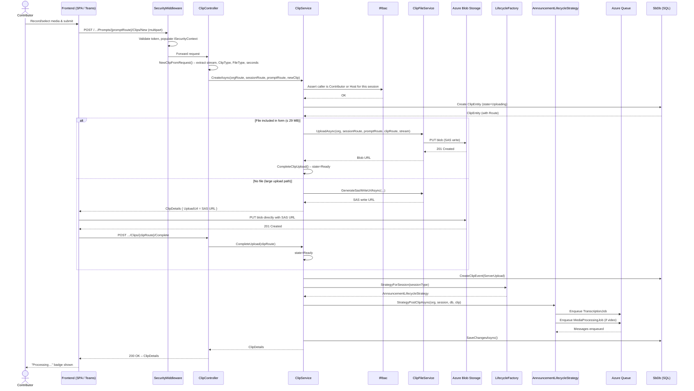

# Flow: Clip Upload

## Overview
Clip upload is the core contribution act: a participant records or selects a media file, and the platform accepts it, persists metadata, stores the binary in Azure Blob Storage (either via direct server upload for small files or a SAS-URL hand-off for large files), and transitions the clip into a state that queues it for downstream media processing and transcription.

## Code Involved

| Layer | File | Role |
|-------|------|------|
| API Controller | [`Soundbite.Api/Controllers/ClipController.cs`](../Soundbite.Api/Controllers/ClipController.cs) | Exposes `POST /organizations/{orgRoute}/Sessions/{sessionRoute}/Prompts/{promptRoute}/Clips/New`; extracts form data |
| Service | [`Soundbite.Services/Services/ClipService.cs`](../Soundbite.Services/Services/ClipService.cs) | Validates RBAC, persists `ClipEntity`, stores file, updates clip state |
| File Service | [`Soundbite.Services/Services/ClipFileService.cs`](../Soundbite.Services/Services/ClipFileService.cs) | Abstracts Azure Blob Storage: upload stream or generate SAS write URL |
| Media Service | [`Soundbite.Services/Services/SbMediaService.cs`](../Soundbite.Services/Services/SbMediaService.cs) | Validates media constraints (duration vs. billing seconds) |
| Lifecycle Factory | [`Soundbite.Services/Lifecycle/LifecycleFactory.cs`](../Soundbite.Services/Lifecycle/LifecycleFactory.cs) | Returns strategy for post-upload lifecycle hook |
| Lifecycle Strategy | [`Soundbite.Services/Lifecycle/AnnouncementLifecycleStrategy.cs`](../Soundbite.Services/Lifecycle/AnnouncementLifecycleStrategy.cs) | `StrategyPostClipAsync` – may queue transcription or media processing |
| Data Model | [`Soundbite.Entity/Entities/ClipEntity.cs`](../Soundbite.Entity/Entities/ClipEntity.cs) | Persisted clip (state, type, fileType, billingSeconds) |
| Data Model | [`Soundbite.Entity/Entities/ClipEventEntity.cs`](../Soundbite.Entity/Entities/ClipEventEntity.cs) | Audit trail of clip state transitions |
| Database | [`Soundbite.Entity/SbDb.cs`](../Soundbite.Entity/SbDb.cs) | EF Core DbContext; `Clips`, `ClipEvents` DbSets |
| Queue | `Masticore.Queue/AzQueue.cs` | Enqueues downstream jobs (transcription, media processing) |
| Security Middleware | [`Soundbite.Api/Middleware/SecurityMiddleware.cs`](../Soundbite.Api/Middleware/SecurityMiddleware.cs) | Populates `ISecurityContext` before controller runs |

## User Perspective

A contributor navigates to the open session in the app, selects the prompt they need to answer, and either records directly in-browser or picks a file from their device. When they click **Submit**, the app packages the video or audio as multipart form data and POSTs it to the API.

If the file is small (under ~29 MB), the server streams it directly to Azure Blob Storage and returns a `ClipDetails` object — the contributor sees a "Processing" badge immediately. If the file is larger, the API instead returns a pre-signed SAS URL, the client uploads directly to Blob Storage, then notifies the server that the upload is complete. Either path results in the same downstream state: `ClipState.Ready`, an audit event recorded, and a queue message sent to trigger video encoding and speech transcription.

## Data Flow Diagram

