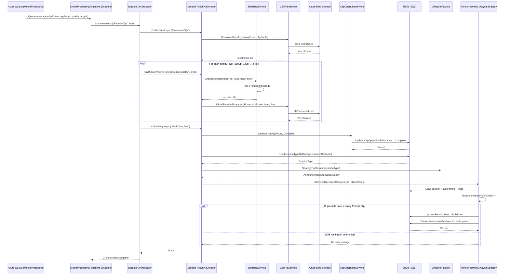

# Flow: Media Processing Pipeline

## Overview
After a clip is uploaded its raw binary goes through an asynchronous encoding pipeline coordinated by Azure Durable Functions. The pipeline downloads the source file, uses FFmpeg (or Azure Media Services historically) to produce multiple resolution variants, uploads the encoded outputs back to Blob Storage, and finally marks the clip operation as complete — signalling the lifecycle strategy to check whether the whole session is now ready to publish.

## Code Involved

| Layer | File | Role |
|-------|------|------|
| Azure Function (entry) | [`Soundbite.AzFunc.MediaProcessing/MediaProcessingFunctions.cs`](../Soundbite.AzFunc.MediaProcessing/MediaProcessingFunctions.cs) | Durable orchestration host; `EncodeClip` orchestrator + `EncodeClipActivity` activities |
| Media Processing Service | [`Soundbite.Services/Services/SbMediaService.cs`](../Soundbite.Services/Services/SbMediaService.cs) | Business logic for encoding decisions (resolution selection, near-factor check) |
| Clip Operation Service | [`Soundbite.Services/Services/ClipOperationService.cs`](../Soundbite.Services/Services/ClipOperationService.cs) | Tracks `ClipOperationEntity` state through Created → InProgress → Complete/Failed |
| File Service | [`Soundbite.Services/Services/ClipFileService.cs`](../Soundbite.Services/Services/ClipFileService.cs) | Blob download + multi-quality upload helpers |
| Lifecycle Factory | [`Soundbite.Services/Lifecycle/LifecycleFactory.cs`](../Soundbite.Services/Lifecycle/LifecycleFactory.cs) | Returns strategy to call `AfterClipOperationComplete` |
| Lifecycle Strategy | [`Soundbite.Services/Lifecycle/AnnouncementLifecycleStrategy.cs`](../Soundbite.Services/Lifecycle/AnnouncementLifecycleStrategy.cs) | Checks whether all prompts are satisfied; transitions session to Published if ready |
| Data Model | [`Soundbite.Entity/Entities/ClipOperationEntity.cs`](../Soundbite.Entity/Entities/ClipOperationEntity.cs) | Persisted operation record with state and error info |
| Data Model | [`Soundbite.Entity/Entities/ClipEntity.cs`](../Soundbite.Entity/Entities/ClipEntity.cs) | Updated with `MediaProcessingState` at completion |
| Database | [`Soundbite.Entity/SbDb.cs`](../Soundbite.Entity/SbDb.cs) | EF Core DbContext |
| FFmpeg | [`FFMpeg/`](../FFMpeg/) | Local FFmpeg binary used inside the function for transcoding |
| Debug / Test API | [`Soundbite.Api/Controllers/ClipController.cs`](../Soundbite.Api/Controllers/ClipController.cs) | `SimulateAmsGridEvent` endpoint for manually re-driving a missed completion event |

## User Perspective

Once a contributor submits their clip the processing badge appears in the session detail view. In the background the platform has placed a job on an Azure Queue. The media processing Azure Function picks it up, downloads the raw clip from Blob Storage, and runs FFmpeg to encode the video at multiple quality levels (1080p → 144p, plus the original). Each encoded variant is uploaded back to Blob Storage into a structured folder hierarchy.

When the last activity completes, the function marks the clip operation "Complete" and triggers the lifecycle strategy to re-evaluate the session. If every required prompt now has a ready clip, the session automatically transitions to "Published" and participants begin to see the content in their feed — all without any manual intervention from the creator.

## Data Flow Diagram

