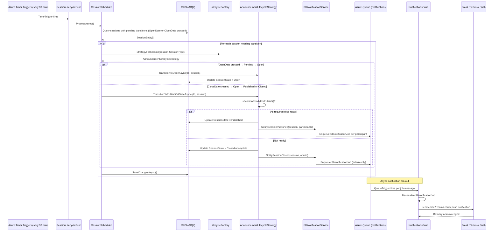

# Flow: Session Lifecycle & Publication

## Overview
Sessions in Soundbite move through a defined lifecycle: Created → Pending (open for contributions) → Published (visible to viewers) → Closed. An Azure Function fires on a timer every 30 minutes, evaluates all sessions with pending state transitions, and advances them according to their scheduled open/close dates. The `AnnouncementLifecycleStrategy` handles the business rules; when publication is triggered it also fans out push and email notifications to all session participants.

## Code Involved

| Layer | File | Role |
|-------|------|------|
| Timer Function | [`Soundbite.AzFunc.Scheduler/SessionLifecycleFunc.cs`](../Soundbite.AzFunc.Scheduler/SessionLifecycleFunc.cs) | Timer trigger (cron `0 0,30 * * * *`); wraps `SessionScheduler.ProcessAsync` |
| Scheduler | [`Soundbite.AzFunc.Scheduler/SessionScheduler.cs`](../Soundbite.AzFunc.Scheduler/SessionScheduler.cs) | Queries sessions whose dates cross a lifecycle boundary; iterates and advances each |
| Lifecycle Factory | [`Soundbite.Services/Lifecycle/LifecycleFactory.cs`](../Soundbite.Services/Lifecycle/LifecycleFactory.cs) | Resolves the correct `ILifecycleStrategy` per session type |
| Lifecycle Strategy | [`Soundbite.Services/Lifecycle/AnnouncementLifecycleStrategy.cs`](../Soundbite.Services/Lifecycle/AnnouncementLifecycleStrategy.cs) | Advances state, expands participants, queues notifications |
| Notification Service | [`Soundbite.Services/ISbNotificationService.cs`](../Soundbite.Services/ISbNotificationService.cs) | Interface for fan-out: email, push, Teams notification channels |
| Notification Function | [`Soundbite.AzFunc.Notifications/NotificationsFunc.cs`](../Soundbite.AzFunc.Notifications/NotificationsFunc.cs) | Queue-triggered function that processes individual `SbNotificationJob` messages |
| Session Service | [`Soundbite.Services/Services/SessionService.cs`](../Soundbite.Services/Services/SessionService.cs) | `ReadAllPendingTransitionsAsync` feed for the scheduler |
| Data Model | [`Soundbite.Entity/Entities/SessionEntity.cs`](../Soundbite.Entity/Entities/SessionEntity.cs) | `SessionState`, `OpenDate`, `CloseDate` fields |
| Data Model | [`Soundbite.Entity/Entities/SessionNotificationEntity.cs`](../Soundbite.Entity/Entities/SessionNotificationEntity.cs) | Tracks which notifications were sent and to whom |
| Database | [`Soundbite.Entity/SbDb.cs`](../Soundbite.Entity/SbDb.cs) | EF Core DbContext |
| Queue | `Masticore.Queue/AzQueue.cs` | `SbNotificationJob.QueueName` queue for fan-out |

## User Perspective

A session author sets a submission deadline of Friday at noon. Shortly after noon, the platform's scheduler wakes up, notices the session's `CloseDate` has passed, and triggers the transition logic. If all required contributors have submitted a clip, the session is marked **Published** — it immediately appears in the feed of all participants who have view access. Each of them receives a notification (email, Teams message, or in-app badge) inviting them to watch.

If some contributors have not yet submitted, the strategy can either auto-close the session with whatever content exists or mark it as closed-incomplete depending on org settings. Either way the status change propagates without any manual administrative action.

## Data Flow Diagram

