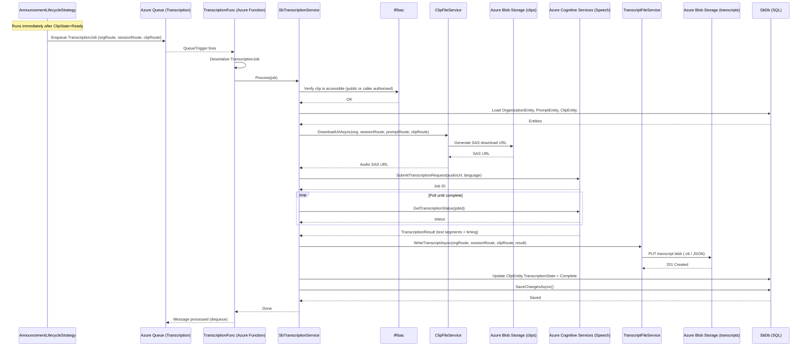

# Flow: Clip Transcription

## Overview
After a clip is uploaded and its media processing is underway, a parallel asynchronous path converts the audio track into a text transcript. The platform enqueues a `TranscriptionJob`, an Azure Function picks it up, downloads the clip audio from Blob Storage, calls the Azure Cognitive Services Speech-to-Text API, and stores the resulting transcript file back in Blob Storage. The transcript is later consumed by the AI Summarization flow and surfaced to viewers as closed captions.

## Code Involved

| Layer | File | Role |
|-------|------|------|
| Lifecycle Strategy | [`Soundbite.Services/Lifecycle/AnnouncementLifecycleStrategy.cs`](../Soundbite.Services/Lifecycle/AnnouncementLifecycleStrategy.cs) | `StrategyPostClipAsync` – enqueues `TranscriptionJob` after clip reaches Ready state |
| Queue | `Masticore.Queue/AzQueue.cs` | Puts `TranscriptionJob` message onto `SbTranscriptionJobQueue` |
| Timer Function | [`Soundbite.AzFunc.Scheduler/TranscriptionFunc.cs`](../Soundbite.AzFunc.Scheduler/TranscriptionFunc.cs) | Queue-triggered Azure Function (`TranscriptionJob.QueueName`); deserialises job and delegates |
| Transcription Service | [`Soundbite.Services/Services/SbTranscriptionService.cs`](../Soundbite.Services/Services/SbTranscriptionService.cs) | Orchestrates: RBAC check, clip download, transcription call, transcript storage, state update |
| Clip File Service | [`Soundbite.Services/Services/ClipFileService.cs`](../Soundbite.Services/Services/ClipFileService.cs) | Generates SAS download URL for the clip audio stream |
| Transcript File Service | [`Soundbite.Services/Services/TranscriptFileService.cs`](../Soundbite.Services/Services/TranscriptFileService.cs) | Writes and reads `.vtt` / JSON transcript blobs in Azure Storage |
| Azure Transcription | `Masticore.Transcription.Azure/` | Wraps Azure Cognitive Services Batch/Real-time Speech API |
| Data Model | [`Soundbite.Entity/Entities/ClipEntity.cs`](../Soundbite.Entity/Entities/ClipEntity.cs) | `ClipType.SupportsTranscription()` guards the flow |
| Queued Job Status | `Masticore/Jobs/IQueuedJobStatusService` | Persists job status for polling by the client |
| Database | [`Soundbite.Entity/SbDb.cs`](../Soundbite.Entity/SbDb.cs) | EF Core DbContext |

## User Perspective

Within a minute or two of submitting a video clip, a contributor (and later any viewer) can see a **Transcript** tab on the clip. The platform automatically converts spoken words to text in the background. Transcripts serve two purposes for end users: accessibility (closed captions rendered alongside playback) and content intelligence (the transcript feeds the AI summary generation feature). The contributor never has to initiate this — it is a fully automatic post-upload service.

## Data Flow Diagram

