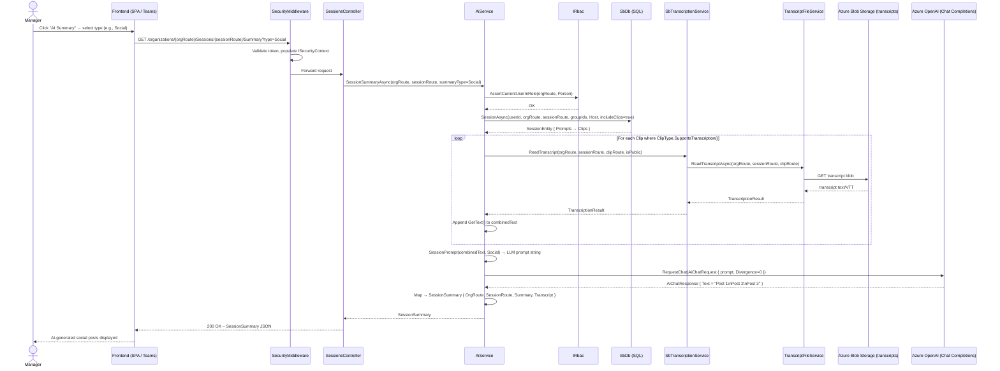

# Flow: AI Summarization

## Overview
Once clips in a published session have transcripts, Soundbite can generate AI-powered summaries — paragraph summaries, social media posts, newsletter articles, or blog drafts. A creator or admin requests a summary type from the web app; the API collects every clip's transcript, concatenates the text, constructs a tailored LLM prompt, calls the Azure OpenAI endpoint, and returns the generated content for the user to review, copy, or publish.

## Code Involved

| Layer | File | Role |
|-------|------|------|
| API Controller | [`Soundbite.Api/Controllers/SessionsController.cs`](../Soundbite.Api/Controllers/SessionsController.cs) | Exposes `GET /organizations/{orgRoute}/Sessions/{sessionRoute}/Summary`; delegates to `IAiService` |
| AI Service | [`Soundbite.Services/Services/AiService.cs`](../Soundbite.Services/Services/AiService.cs) | Orchestrates: RBAC, transcript aggregation, prompt construction, LLM call, result mapping |
| Transcription Service | [`Soundbite.Services/Services/SbTranscriptionService.cs`](../Soundbite.Services/Services/SbTranscriptionService.cs) | `ReadTranscript` – reads stored `.vtt`/JSON from Blob Storage per clip |
| Transcript File Service | [`Soundbite.Services/Services/TranscriptFileService.cs`](../Soundbite.Services/Services/TranscriptFileService.cs) | Blob Storage accessor for transcript files |
| AI Client | `Masticore.Ai/IAiClient` | Interface wrapping the Azure OpenAI Chat Completion API |
| RBAC | `Masticore/Security/IRbac` | Asserts caller is at least a `Person` in the org before reading session content |
| Data Model | [`Soundbite.Entity/Entities/ClipEntity.cs`](../Soundbite.Entity/Entities/ClipEntity.cs) | `ClipType.SupportsTranscription()` controls which clips contribute text |
| Database | [`Soundbite.Entity/SbDb.cs`](../Soundbite.Entity/SbDb.cs) | EF Core DbContext; loads `SessionEntity` with `Prompts → Clips` |
| Security Middleware | [`Soundbite.Api/Middleware/SecurityMiddleware.cs`](../Soundbite.Api/Middleware/SecurityMiddleware.cs) | Populates `ISecurityContext` before controller |

## User Perspective

A communications manager opens a published session, clicks the **AI Summary** button, and picks "Social Media Post" from a dropdown. The app fires a request to the API. Within a few seconds the panel fills with three ready-to-copy social posts generated from the actual transcript of every video in the session. The manager can regenerate, choose a different format (paragraph, newsletter, blog), or copy the text directly into their channel of choice. No manual note-taking required — the platform distills the recorded content into publication-ready copy automatically.

## Data Flow Diagram

