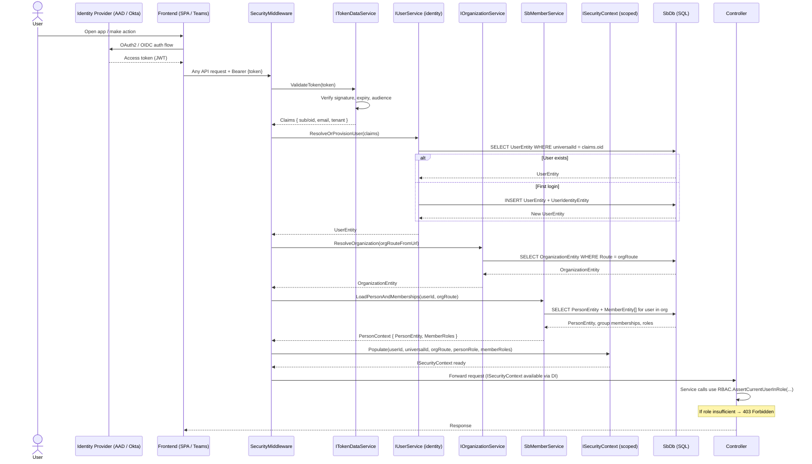

# Flow: Authentication & Security Context

## Overview
Every HTTP request to the Soundbite API passes through a custom `SecurityMiddleware` before reaching any controller. This middleware validates the inbound JWT (issued by AAD/Entra or Okta), resolves the platform user record, determines the current organization context from the route, evaluates group memberships, and populates a scoped `ISecurityContext` that all downstream services consume for identity-aware queries and RBAC enforcement.

## Code Involved

| Layer | File | Role |
|-------|------|------|
| Middleware | [`Soundbite.Api/Middleware/SecurityMiddleware.cs`](../Soundbite.Api/Middleware/SecurityMiddleware.cs) | Pipeline entry point; invokes `SecurityMiddlewareHandler` |
| Token Validation | `Masticore/Token/ITokenDataService` | Validates JWT signature, extracts claims (`sub`, `oid`, `email`) |
| Identity Infrastructure | `Masticore.Entity/IIdentityInfrastructure` | EF-backed store for `UserEntity`, `UserIdentityEntity`, `TenantEntity` |
| User Service | `Masticore.Services/IUserService` | Resolves or auto-provisions the platform `UserEntity` from token claims |
| Organization Service | [`Soundbite.Services/Services/SbOrganizationService.cs`](../Soundbite.Services/Services/SbOrganizationService.cs) | Reads `OrganizationEntity` for the route present in the URL |
| Member Service | [`Soundbite.Services/Services/SbMemberService.cs`](../Soundbite.Services/Services/SbMemberService.cs) | Loads the calling user's `PersonEntity` and their group memberships within the org |
| Security Context | `Masticore/Security/ISecurityContext` | Scoped container: `CurrentUserId`, `UniversalId`, `OrgRoute`, `Roles` |
| RBAC | `Masticore/Security/IRbac` | Service-layer enforcement; `AssertCurrentUserInRole(orgRoute, minRole)` |
| Auth Providers | [`Soundbite.Api/Controllers/AzureAuthController.cs`](../Soundbite.Api/Controllers/AzureAuthController.cs), [`OktaAuthController.cs`](../Soundbite.Api/Controllers/OktaAuthController.cs) | Handle provider-specific auth redirect / token exchange handshakes |
| Database | [`Soundbite.Entity/SbDb.cs`](../Soundbite.Entity/SbDb.cs) | EF Core DbContext — `Users`, `UserIdentities`, `Organizations`, `People`, `Members` DbSets |
| Service Composition | [`Soundbite.Api/SbApiUtils.cs`](../Soundbite.Api/SbApiUtils.cs) | Registers middleware, auth providers, and security services in the DI container |

## User Perspective

When a user opens the Soundbite web app or accesses it via Microsoft Teams, they are silently authenticated using their enterprise identity (Azure AD or Okta). If this is their first login, the platform auto-provisions their user record. For every subsequent API call their access token travels as a `Bearer` header; the middleware verifies it, maps it to their internal user account, and loads their role within the active organization.

If a user tries to access a session that belongs to a different org, or attempts an admin action without the right role, the RBAC layer returns a `403 Forbidden` before any business logic executes. This means every service function can assume an authenticated, authorized identity context without repeating those checks.

## Data Flow Diagram

