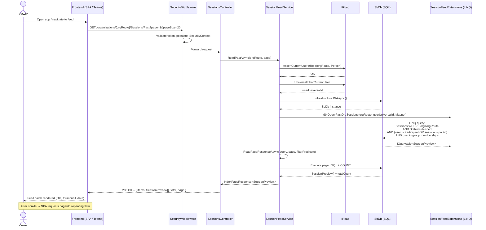

# Flow: Session Feed & Content Discovery

## Overview
The session feed is the primary consumption experience: authenticated users see a personalized, paginated list of published sessions relevant to them — scoped to their organization and the groups they belong to. The platform distinguishes between sessions that are still "Pending" (open for contributions) and those already "Published" (ready to watch). Feed queries enforce RBAC at the data layer, applying group-membership filters so users only see content they are authorized to access.

## Code Involved

| Layer | File | Role |
|-------|------|------|
| API Controller | [`Soundbite.Api/Controllers/SessionsController.cs`](../Soundbite.Api/Controllers/SessionsController.cs) | Exposes `/organizations/{orgRoute}/Sessions/Pending`, `/Past`, `/Feed`, and group-scoped variants |
| Feed Service | [`Soundbite.Services/Services/SessionFeedService.cs`](../Soundbite.Services/Services/SessionFeedService.cs) | `ReadPendingAsync`, `ReadPastAsync`, `ReadPublishedAsync` — paged RBAC-aware queries |
| Feed Extensions | [`Soundbite.Services/Services/SessionFeedExtensions.cs`](../Soundbite.Services/Services/SessionFeedExtensions.cs) | EF extension methods: `QueryPendingOrgSessions`, `QueryPastOrgSessions`, `QueryPendingGroupSessions` |
| Session Service | [`Soundbite.Services/Services/SessionService.cs`](../Soundbite.Services/Services/SessionService.cs) | Legacy `ReadFeedAsync_Obsolete`, `ReadPublicFeedAsync_Obsolete` (retained for compatibility) |
| RBAC | `Masticore/Security/IRbac` | `AssertCurrentUserInRole` and `UniversalIdForCurrentUser` — gate and identity source |
| Database | [`Soundbite.Entity/SbDb.cs`](../Soundbite.Entity/SbDb.cs) | EF Core DbContext; `Sessions`, `Prompts`, `Participants`, `Groups`, `Members` DbSets |
| DB Extensions | [`Soundbite.Entity/SbDbExtensions.cs`](../Soundbite.Entity/SbDbExtensions.cs) | `GroupIdsAsync`, `QueryPendingOrgSessions`, shared LINQ query helpers |
| Security Middleware | [`Soundbite.Api/Middleware/SecurityMiddleware.cs`](../Soundbite.Api/Middleware/SecurityMiddleware.cs) | Provides `ISecurityContext` with current user's universalId |
| Frontend Store | `Soundbite.Client/packages/widgets.react/src/store/` | MobX stores that call the feed endpoints and manage paging state on the client |

## User Perspective

When a viewer opens the Soundbite app they land on a feed of sessions. The "Pending" tab shows sessions they are expected to contribute to, while the "Past" / "Published" tab shows announcements they can watch. The feed is paginated — the app requests the first page and loads more as the user scrolls. Each item in the feed is a lightweight `SessionPreview` card (title, thumbnail, contributor count, deadline) to keep the payload small.

Crucially, the feed is personalized and secure: users only see sessions their org membership and group roles entitle them to. An employee in the Engineering group does not see sessions limited to the Marketing group, even if both groups are in the same organization.

## Data Flow Diagram

