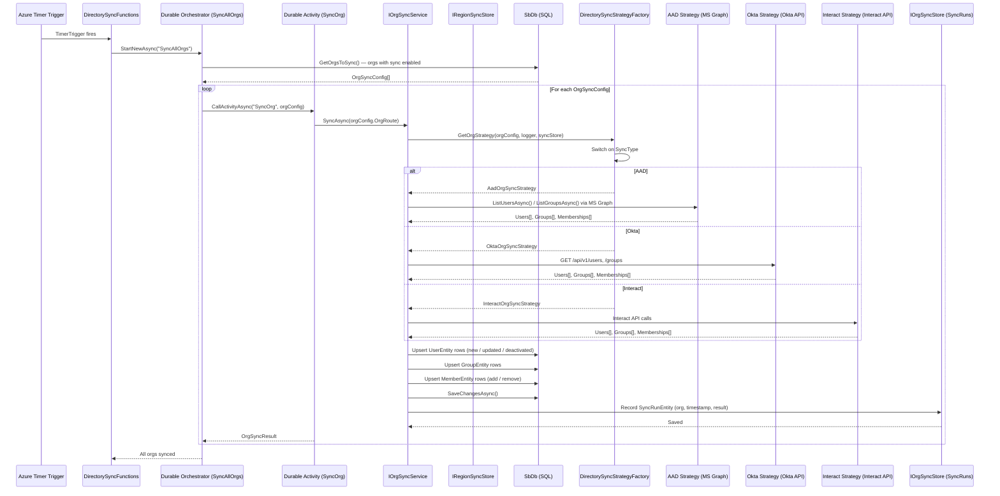

# Flow: Directory Sync (Enterprise Identity Integration)

## Overview
Soundbite integrates with enterprise identity directories — Azure Active Directory (Entra ID), Okta, and Interact — to automatically mirror users, groups, and memberships into the platform. A Durable Function orchestration fires on a scheduled interval, fetches all organizations that have directory sync enabled, and fans out a sync activity per org. A provider-specific strategy (selected by a factory) performs the actual directory API calls and reconciles the result against the platform's identity data store.

## Code Involved

| Layer | File | Role |
|-------|------|------|
| Timer Function | [`Soundbite.AzFunc.DirectorySync/DirectorySyncFunctions.cs`](../Soundbite.AzFunc.DirectorySync/DirectorySyncFunctions.cs) | Durable orchestration entry: `SyncAllOrgsTimer` → `SyncAllOrgs` orchestrator → `SyncOrg` activity |
| Org Sync Service | `Masticore.DirectorySync/IOrgSyncService` | `SyncAsync(orgRoute)`: drives the full sync for a single org |
| Sync Strategy Factory | [`Soundbite.Services/DirectorySyncStrategyFactory.cs`](../Soundbite.Services/DirectorySyncStrategyFactory.cs) | Returns `IOrgSyncStrategy` based on `OrgSyncConfig.SyncType` (AAD / Okta / Interact) |
| AAD Strategy | `Masticore.DirectorySync.Aad/AadOrgSyncStrategy` | Uses Microsoft Graph to enumerate users and groups |
| Okta Strategy | `Masticore.DirectorySync.Okta/OktaOrgSyncStrategy` | Uses Okta REST API to enumerate users and groups |
| Interact Strategy | `Masticore.DirectorySync.Interact/InteractOrgSyncStrategy` | Uses Interact API to enumerate users and groups |
| Sync Job Worker | `Masticore.DirectorySync/ISyncJobWorker` | Queue-backed path for incremental / event-driven sync jobs |
| Org Sync Store | `Masticore.DirectorySync/IOrgSyncStore` | Reads/writes `SyncRunEntity` (last run time, result) |
| Region Sync Store | `Masticore.DirectorySync/IRegionSyncStore` | Multi-region coordination for federated org syncs |
| Sync Infrastructure | `Masticore.DirectorySync/ISyncInfrastucture` | Database access for sync operations |
| Database | [`Soundbite.Entity/SbDb.cs`](../Soundbite.Entity/SbDb.cs) | `Organizations`, `Users`, `Groups`, `Members`, `SyncRuns` DbSets |

## User Perspective

An IT administrator enables Azure AD synchronization in the Soundbite org settings, supplying tenant credentials. From that point forward, the platform automatically imports the company's employee list and team structure. New employees provisioned in Azure AD appear in Soundbite within the next sync window. Employees who leave have their access revoked automatically without any manual deprovisioning step. Group-scoped sessions and notification routing stay accurate because the group membership data is always fresh.

From the end-user perspective this is invisible — they simply log in with their corporate SSO credentials and immediately see content scoped to their teams. The sync machinery runs entirely in the background.

## Data Flow Diagram

