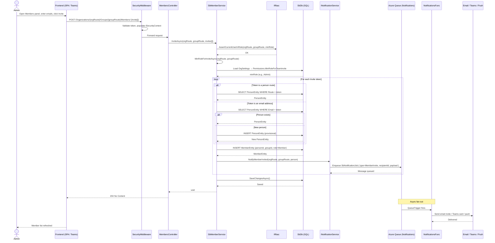

# Flow: Team Member Invite & Onboarding

## Overview
Soundbite supports invitation-based onboarding: an existing member with sufficient permissions can invite one or more people into an organization group (team). An invitation can reference either an existing person route or an email address for someone not yet in the platform. The invite is processed by the member service, which resolves or provisions the person record, creates the group membership, and enqueues notification messages to inform the new member. This flow embodies the primary product-led growth (PLG) mechanism in the current platform.

## Code Involved

| Layer | File | Role |
|-------|------|------|
| API Controller | [`Soundbite.Api/Controllers/MembersController.cs`](../Soundbite.Api/Controllers/MembersController.cs) | Exposes `POST /Organizations/{orgRoute}/Groups/{groupRoute}/Members/` accepting `Invite[]` |
| Member Service | `Masticore.Services/MemberService` | Base invite logic: resolve/provision person, assert min role, create `MemberEntity`, enqueue notification |
| Sb Member Service | [`Soundbite.Services/Services/SbMemberService.cs`](../Soundbite.Services/Services/SbMemberService.cs) | Overrides `MinRoleForInviteAsync` — reads org setting `Permissions.MinRoleForTeamInvite` |
| Notification Service | `Masticore/Services/INotificationService` | Accepts notification request; fans out to queue |
| Notification Function | [`Soundbite.AzFunc.Notifications/NotificationsFunc.cs`](../Soundbite.AzFunc.Notifications/NotificationsFunc.cs) | Queue-triggered; processes `SbNotificationJob`, dispatches email/Teams/push |
| Invite Model | `Masticore/Models/Invite.cs` | DTO: `Token` = person route OR email address |
| Frontend Stores | `Soundbite.Client/packages/widgets.react/src/store/MemberStore.ts`, `PersonStore.ts`, `UserStore.ts` | Client-side MobX stores driving invite UI and refreshing member lists |
| Feature Flags | [`Soundbite.Api/Models/FeatureFlags.cs`](../Soundbite.Api/Models/FeatureFlags.cs) | `ReferralEnabled` gate for invite-related discovery features |
| RBAC | `Masticore/Security/IRbac` | Validates that the inviting user holds at least the minimum required role |
| Database | [`Soundbite.Entity/SbDb.cs`](../Soundbite.Entity/SbDb.cs) | `People`, `Members`, `Groups`, `Organizations` DbSets |
| Queue | `Masticore.Queue/AzQueue.cs` | `SbNotificationJob.QueueName` for async notification delivery |

## User Perspective

A team administrator opens the **Team Members** panel, types one or more email addresses or picks colleagues from a search dropdown, then clicks **Invite**. The app sends the invite list to the API. If the invitees already have Soundbite accounts they are added to the group immediately and receive an in-app or email notification. If an email belongs to someone without an account, a provisional person record is created and the platform sends an invitation email that prompts them to sign in via SSO.

From the invitee's perspective they receive a notification that says "You've been added to [Team Name]" — clicking it opens the app directly in the relevant team context, showing the feed of sessions they now have access to. This frictionless join-by-invite mechanic is the primary way teams grow within an enterprise org.

## Data Flow Diagram

