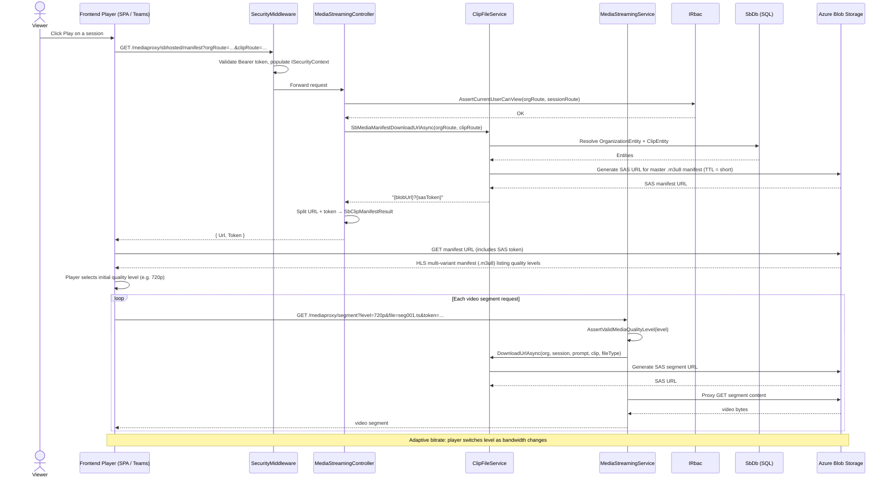

# Flow: Secure Media Streaming

## Overview
Published sessions must deliver video securely to authorized viewers. Soundbite uses a manifest proxy architecture: the player requests a per-session HLS manifest URL (with an embedded SAS token) from the API, then streams individual video segments directly from Azure Blob Storage using that token. For externally-hosted content (legacy Azure Media Services path), the API re-signs proxy URLs on the fly, preventing unauthorized off-platform access to media files at any quality level.

## Code Involved

| Layer | File | Role |
|-------|------|------|
| API Controller | [`Soundbite.Api/Controllers/MediaStreamingController.cs`](../Soundbite.Api/Controllers/MediaStreamingController.cs) | Exposes `/mediaproxy/sbhosted/manifest` (SB-hosted) and `/mediaproxy/…` (AMS proxy) endpoints |
| Media Streaming Service | [`Soundbite.Services/Services/MediaStreamingService.cs`](../Soundbite.Services/Services/MediaStreamingService.cs) | Builds HLS multi-variant playlists; rewrites segment URLs with fresh SAS tokens |
| Clip File Service | [`Soundbite.Services/Services/ClipFileService.cs`](../Soundbite.Services/Services/ClipFileService.cs) | `SbMediaManifestDownloadUrlAsync`, `DownloadUrlAsync` — generates time-limited SAS URLs for blobs |
| Session Service | [`Soundbite.Services/Services/SessionService.cs`](../Soundbite.Services/Services/SessionService.cs) | `HydrateClipsAsync` — loads per-clip SAS download URLs when serving `SessionDetails` |
| RBAC | `Masticore/Security/IRbac` | Authorizes viewer before issuing any SAS token |
| Security Middleware | [`Soundbite.Api/Middleware/SecurityMiddleware.cs`](../Soundbite.Api/Middleware/SecurityMiddleware.cs) | Populates `ISecurityContext` for authenticated playback requests |
| Data Model | [`Soundbite.Entity/Entities/ClipEntity.cs`](../Soundbite.Entity/Entities/ClipEntity.cs) | `FileType`, `ClipHostingType` determine which storage path is used |
| Database | [`Soundbite.Entity/SbDb.cs`](../Soundbite.Entity/SbDb.cs) | EF Core DbContext — resolves org/session/clip entities |
| Azure Blob Storage | *(infrastructure)* | Origin for all encoded video segments and manifest files |
| Streaming Constants | [`Soundbite.Services/Services/MediaStreamingService.cs`](../Soundbite.Services/Services/MediaStreamingService.cs) | `SupportedLevels` (1080p → 144p + orig), `ManifestProxyUrl` template |

## User Perspective

A viewer opens a published session and clicks play. The video player makes a request to the Soundbite API for the manifest URL. The API checks the viewer's authorization, then returns a short-lived pre-signed URL pointing to the HLS manifest file in Azure Blob Storage. The player fetches the manifest, discovers the available quality levels, and begins requesting video segments directly from Blob Storage using the embedded SAS token. If the viewer's bandwidth changes, the player transparently switches quality levels — all segment URLs are rewritten with valid tokens by the proxy before the player ever sees them.

The result: content can never be hot-linked or accessed without a valid, time-expiring authorization token issued to an authenticated, authorized user.

## Data Flow Diagram

