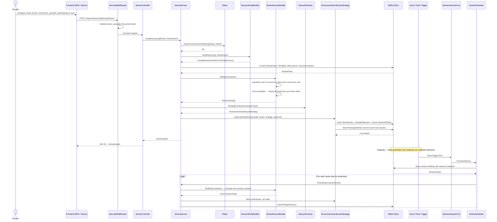

# Flow: Recurring Series Scheduling

## Overview
A Series is a template-driven recurring session schedule: an author defines a session template once (prompts, participants, settings) and attaches a recurrence rule. The platform auto-generates future session instances from the template on a timer, ensuring that each cycle opens for contributions, collects clips, and publishes without the creator having to recreate the session manually. A separate Durable Function monitors series and spawns new instances as scheduled dates arrive.

## Code Involved

| Layer | File | Role |
|-------|------|------|
| API Controller | [`Soundbite.Api/Controllers/SeriesController.cs`](../Soundbite.Api/Controllers/SeriesController.cs) | Exposes CRUD for `Series`; `POST /organizations/{orgRoute}/Series/` |
| Series Service | [`Soundbite.Services/Services/SeriesService.cs`](../Soundbite.Services/Services/SeriesService.cs) | Creates `SeriesEntity` + template `SessionEntity` + initial instance sessions |
| Session Entity Builder | [`Soundbite.Services/SessionEntityBuilder.cs`](../Soundbite.Services/SessionEntityBuilder.cs) | Constructs the template `SessionEntity` from `NewSession` |
| Series Session Builder | [`Soundbite.Services/SeriesSessionBuilder.cs`](../Soundbite.Services/SeriesSessionBuilder.cs) | Clones the template into future `SessionEntity` instances according to recurrence rules |
| Timer Function | [`Soundbite.AzFunc.Scheduler/SeriesLifecycleFunc.cs`](../Soundbite.AzFunc.Scheduler/SeriesLifecycleFunc.cs) | Timer trigger (cron); calls `SeriesScheduler.ProcessAsync` |
| Series Scheduler | [`Soundbite.AzFunc.Scheduler/SeriesScheduler.cs`](../Soundbite.AzFunc.Scheduler/SeriesScheduler.cs) | Queries series due for new instance generation; calls `SeriesService.ExtendAsync` |
| Lifecycle Factory | [`Soundbite.Services/Lifecycle/LifecycleFactory.cs`](../Soundbite.Services/Lifecycle/LifecycleFactory.cs) | Returns strategy for newly spawned sessions |
| Lifecycle Strategy | [`Soundbite.Services/Lifecycle/AnnouncementLifecycleStrategy.cs`](../Soundbite.Services/Lifecycle/AnnouncementLifecycleStrategy.cs) | Seeds participants, sets initial state for each new session instance |
| Data Model | [`Soundbite.Entity/Entities/SeriesEntity.cs`](../Soundbite.Entity/Entities/SeriesEntity.cs) | `Recurrence`, `RecurrenceData`, `Template` session link |
| Data Model | [`Soundbite.Entity/Entities/SessionEntity.cs`](../Soundbite.Entity/Entities/SessionEntity.cs) | `IsTemplate` flag; `SeriesId` backlink |
| Database | [`Soundbite.Entity/SbDb.cs`](../Soundbite.Entity/SbDb.cs) | EF Core DbContext; `Series`, `Sessions` DbSets |

## User Perspective

A communications manager wants to run a weekly executive update — same format, same participant list, every Monday. They create a Series in the app, configure the prompt template (e.g., "What did you accomplish this week?"), add the executives as contributors, and pick a weekly recurrence. The platform generates the first few session instances immediately. Each Monday a new session automatically becomes active and contributors receive their reminder notification; when the submission window closes the session self-publishes, just like any one-off session. The manager never has to manually create "this week's session."

## Data Flow Diagram

